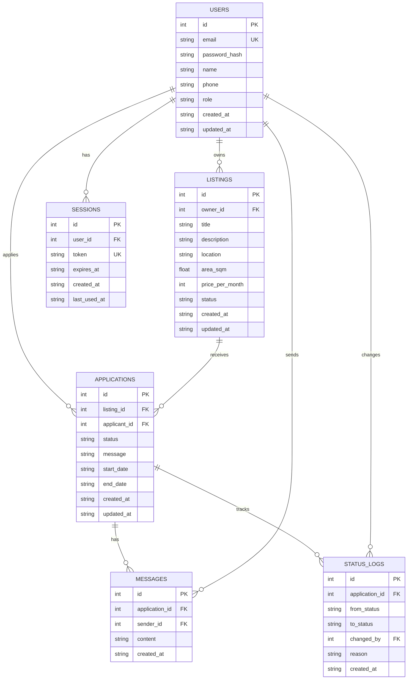

# ttangbu 데이터베이스 ERD

## 엔터티 관계 다이어그램

## 주요 제약

- `users.email` 유니크
- `sessions.token` 유니크
- `applications(listing_id, applicant_id)` 유니크
- 상태 enum 체크
  - `listings.status`: `active | inactive | rented`
  - `applications.status`: `pending | approved | rejected | active | cancelled | completed`
